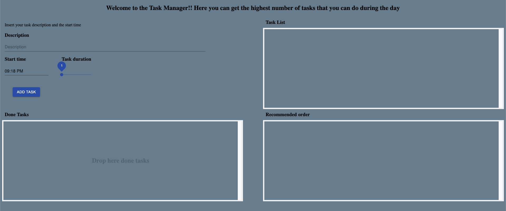
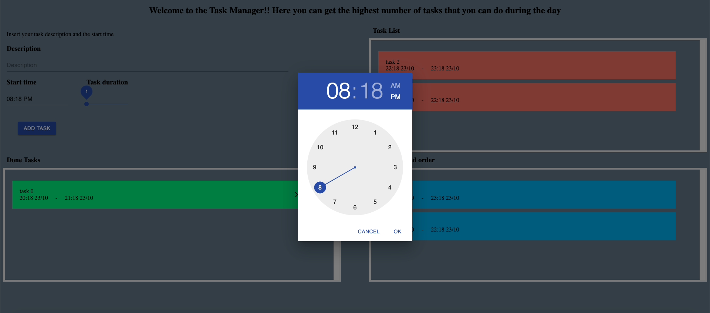
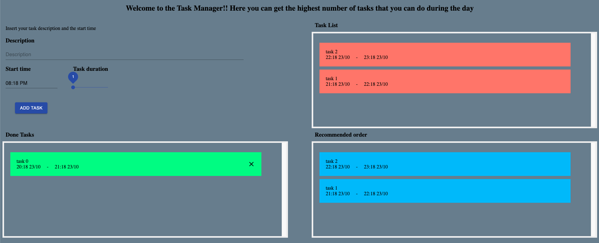

# TaskManager

**Número da Lista**: 3 
**Conteúdo da Disciplina**: Greed 

## Alunos
|Matrícula | Aluno |
| -- | -- |
| 16/0119316 |  Ezequiel de Oliveira dos Reis |
| 16/0148375  |  Vitor Leal dos Santos |

## Sobre 
O projeto consiste na organizacao de tarefas diarias de forma automatizada por meio do algoritmo de interval scheduling. Com isso, podemos obter a melhor sequencia possivel em que as tarefas devem ser realizadas. 

## Screenshots

## Instalação 
**Linguagem**: Javascript 
**Framework**: React 

Primeiramente devemos clonar o repositório:

    $ git clone https://github.com/projeto-de-algoritmos/Greed_TaskManager

Após clonar o repositório, é preciso acessar a pasta do projeto:

    $ cd Greed_TaskManager

Para rodar o projeto é necessário ter instalado o [yarn](https://classic.yarnpkg.com/pt-BR/docs/install/#debian-stable) na versão estável mais atual.

Após instalar o yarn, vamos instalar as dependências do projeto.

    Na pasta raiz, execute:

    $ yarn install

Depois, subir o servidor:

    $ yarn start

E então acessar no navegador:

    http://localhost:3000/

## Uso 
Devemos inserir uma tarefa com seu respectivo horario e descricao e adicionar para ser possivel ver a lista de tarefas. Com isso, as tarefas sao organizadas automaticamente na melhor ordem possivel, caso seja necessario colocar uma tarefa como concluida ou deletar, basta arrasta-la para a parte de Done Tasks.

## Outros 
